<div align="center">

# 🌊 FloodGuard India

### Dam-break and flash-flood inundation modelling for any Indian river

**Smart India Hackathon — Problem Statement 26161**

[](SPEC.md)
[](docs/validation/summary.md)
[](backend/tests)


*Simulate a dam break from real terrain. Route the wave with a verified solver.*
*Count who is in its path. Trace every number back to the file it came from.*

</div>

---

## 📋 The problem

> **PS 26161 — "Dam Break Inundation Modelling Using Hydrodynamic Modelling of any River."**

When a large dam fails, the reservoir does not drain — it collapses. Tehri holds
3,540 million cubic metres behind a 260 m head. A breach releases that into a
Himalayan gorge, and the wave reaches the first town in **minutes**, not hours.
Downstream lie Devprayag, Rishikesh and Haridwar.

Answering *"what happens, where, and how long do people have"* requires four
things that rarely exist together:

| The gap | Why it matters |
| :-- | :-- |
| 🏔️ **Real terrain, not a textbook channel** | Flood extent is set by the valley's shape. A 1D channel model cannot tell you which neighbourhood floods. |
| ⚙️ **A solver that is actually correct** | A 2D shallow-water code that is not well-balanced invents metres-per-second currents on a still lake. The map still looks plausible. |
| 🔁 **Generality, not one tuned valley** | A model that works only for the dam it was built for is a case study, not a tool. |
| 👥 **Consequences, not just water** | "Peak depth 12 m" is not actionable. "1,840 buildings, 2 hospitals, 47 minutes of warning" is. |

FloodGuard India is built to close all four — and to **refuse to answer** when it
cannot, rather than guessing.

---

## 🎯 What we set out to build

The problem statement asks for seven deliverables. Here is each one, and where
it honestly stands today.

| # | Deliverable | Status |
| :--: | :-- | :-- |
| 1 | Generalized framework simulating dam break / river blockage from real DEM + hydrological data | ✅ **Done** |
| 2 | **Two independent hydrodynamic engines** with a quantitative comparison | 🟡 **One engine verified.** Second in progress — see [Roadmap](#-roadmap) |
| 3 | Inundation scenarios from swappable input datasets — any river, any dam | ✅ **Done** — adding a dam is a YAML file |
| 4 | Web dashboard for input and output, handling large rasters | ✅ **Done** — React + MapLibre |
| 5 | Exports to `.shp`, `.kml`, `.geojson`, `.tif` + PDF report | ✅ **Done** — plus COG and KMZ |
| 6 | Near-real-time flood mapping via Google Earth Engine + Sentinel-1 | 🟡 **Built, never executed** — needs credentials |
| 7 | HADR loss-and-damage analysis inside the inundation polygon | 🟡 **Built, awaiting exposure layers** |

> **Why the honest status column?** Because rule #1 of this project is that
> nothing claims to be more finished than it is — including this README. A
> deliverable marked 🟡 is one whose code you can inspect today; it is not
> vapour, and it is not pretending to be complete.

---

## 🗺️ How it works — the full pipeline

```mermaid
flowchart TB
    subgraph IN["📥 PHASE 1 · INPUTS — real, checksummed, cached"]
        direction LR
        DEM["<b>Copernicus GLO-30</b><br/>AWS · keyless · SHA256"]
        NRLD["<b>CWC NRLD-2019</b><br/>30 dams · cited per field"]
        EXP["<b>OSM + WorldPop</b><br/>buildings · roads · people"]
        SAT["<b>Sentinel-1 GRD</b><br/>via Earth Engine"]
    end

    YAML["⚙️ <b>Scenario YAML</b><br/>dam · river · breach · resolution · duration<br/><i>adding a dam changes no code</i>"]

    subgraph PRE["🏔️ PHASE 2 · TERRAIN CONDITIONING"]
        direction LR
        HYD["Priority-flood fill<br/>D8 · accumulation<br/>watershed · corridor mask"]
        RES["Reservoir delineation<br/>elevation–area–capacity<br/>bathymetry reconstruction"]
        SEC["Cross-sections<br/>at towns + 10 km<br/>Manning n field"]
    end

    subgraph BR["💥 PHASE 3 · BREACH + RESERVOIR ROUTING"]
        direction LR
        PAR["<b>3 breach models</b><br/>Froehlich 2008<br/>Von Thun and Gillette 1990<br/>MacDonald and L-M 1984"]
        OUT["Weir + orifice outflow<br/>Villemonte submergence<br/>level-pool · adaptive RK2"]
    end

    HYDRO["📈 <b>Breach hydrograph Q(t)</b><br/>mass closure 0.0000%<br/><i>validated vs Teton 1976 and Banqiao 1975</i>"]

    subgraph ENG["🌊 PHASE 4 · HYDRODYNAMIC ENGINES — one contract"]
        direction LR
        SWE["<b>FloodGuard-SWE</b> ✅<br/>Godunov FV · MUSCL-minmod<br/>HLLC · Audusse well-balanced<br/>numba-jitted<br/><b>verified 7/7</b>"]
        ALT["<b>Cross-check engine</b> 🟡<br/>ANUGA / PySPH<br/><i>populates the<br/>comparison table</i>"]
        ADP["<b>Adapters</b> 📦<br/>Delft3D FM deck<br/>DualSPHysics CaseDef<br/><i>run if binaries exist</i>"]
    end

    subgraph POST["🎨 PHASE 5 · RASTERS, HAZARD, EXPORTS"]
        direction LR
        RAS["max depth · max velocity<br/>arrival time · D×V hazard"]
        HAZ["AIDR Handbook 7 §6.1<br/>hazard classification"]
        EXPT["COG · SHP · GeoJSON<br/>KML / KMZ · CSV"]
    end

    IMP["👥 <b>PHASE 6 · HADR IMPACT</b><br/>population · buildings · roads · hospitals<br/>schools · bridges · evacuation priority by lead time"]

    GEE["🛰️ <b>PHASE 8 · NEAR-REAL-TIME</b><br/>Sentinel-1 change detection · refined Lee<br/>per-scene Otsu · JRC water excluded<br/>CSI / POD / FAR vs simulation"]

    subgraph DEL["🖥️ PHASE 7 · 9 · 10 · DELIVERY"]
        direction LR
        API["<b>FastAPI</b><br/>SQLite job store<br/>WebSocket progress"]
        UI["<b>React + MapLibre</b><br/>3-column simulation page<br/>hydrographs · sections"]
        PDF["<b>PDF report</b><br/>git hash on every page<br/>caveats in the body"]
    end

    PROV["🔒 <b>PROVENANCE ON EVERY OUTPUT</b><br/>DEM source · dam parameters + citations · engine + version<br/>solver settings · git commit · UTC timestamp"]

    DEM --> YAML
    NRLD --> YAML
    EXP -.-> IMP
    SAT -.-> GEE
    YAML --> PRE
    PRE --> BR
    BR --> HYDRO
    HYDRO --> ENG
    ENG --> POST
    POST --> IMP
    POST --> DEL
    IMP --> DEL
    GEE --> DEL
    POST -.->|"CSI / POD / FAR"| GEE
    DEL --> PROV

    classDef keyNode fill:#EAF3FB,stroke:#2C6FAF,stroke-width:2px,color:#0B2A45
    classDef pending fill:#FFF6E0,stroke:#D68A00,stroke-width:2px,color:#0B2A45
    classDef rule fill:#F3EDFB,stroke:#7B4FC0,stroke-width:2px,color:#0B2A45

    class YAML,HYDRO keyNode
    class IMP,GEE pending
    class PROV rule
```



**Read it as a contract.** Each stage consumes files and emits files, and every
emitted file records what produced it. There is no step at which a number is
introduced by hand.

---

## ⭐ What makes this different

Most dam-break demos show a map. The three things that matter here sit behind it.

### 1️⃣ The solver is verified against exact analytical solutions

Verification asks whether the code solves the equations it *claims* to solve.
These are closed-form solutions and exact invariants, so the comparison is not a
matter of opinion.

| Check | Result | Criterion |
| :-- | :-- | :-- |
| **Ritter (1892)** dry-bed dam break | relative L2 **0.503%**, h(dam) error **1.90%** | < 5% |
| **Stoker (1957)** wet-bed dam break | relative L2 **1.101%**, shock within **0.06 cells** | < 12 cells |
| **Lake at rest**, irregular bed (118 m relief) | spurious discharge **3.92e-12**, drift **1.42e-14 m** | < 1e-10 |
| **Mass conservation**, fully wet | relative volume error **1.72e-16** | < 1e-9 |
| **Wet/dry mass budget** | relative mass loss **0.002%** | < 1% |
| **Grid convergence** (Ritter) | observed order **0.92** | > 0.8 |
| **Frictional dam break** | rough 1175 m < frictionless 1318 m ≤ Ritter 1396 m | never outruns Ritter |

```bash
make validate     # reproduces all seven in ~20 seconds
```

Plots and full error tables: **[`docs/validation/`](docs/validation/)**.

> The Ritter front lags the analytical front by 21.1%, and that is **documented,
> not hidden**: a monotone second-order scheme cannot resolve the infinite
> gradient where depth reaches zero. What matters is the direction — the
> modelled flood must never arrive *earlier* than physics allows.

### 2️⃣ Nothing is labelled as something it is not

`GET /api/health/engines` probes the machine. When Delft3D binaries are absent,
the API response, the UI badge and the PDF cover all read
`FloodGuard-SWE (Delft3D-class FV solver)` — **never** `Delft3D`.

Three tests fail the build if any code path emits the wrong string:

```
test_health.py::test_unavailable_delft3d_is_never_labelled_delft3d
test_swe_fv.py::test_engine_never_claims_to_be_delft3d
test_engines_adapters.py::test_delft3d_refuses_to_run_without_a_binary
```

The same rule holds for SPH. PySPH is named when PySPH runs; when it cannot, the
engine reports itself **unavailable** rather than returning a depth-averaged
result under an SPH label.

### 3️⃣ "Not computed" is never rendered as zero

A layer that failed to download shows an **em dash** and a reason on hover.
`None` in Python, `null` in JSON, `—` in the UI. Enforced in
[`frontend/src/components/Value.tsx`](frontend/src/components/Value.tsx); there
is no code path that turns a null into a number.

*Zero buildings flooded* and *we could not fetch the building layer* are
different statements about the world. Conflating them in a flood exposure report
is dangerous.

---

## 🚀 Quickstart

```bash
git clone https://github.com/kalpitphogat/Sih.git && cd Sih

pip install -r requirements.txt && pip install -e backend
cd frontend && npm install && cd ..
```

Verify the install **in this order**:

```bash
python -m floodguard.cli engines      # honest engine availability table
python -m pytest backend/tests -q     # 115 passed
python -m floodguard.cli validate     # 7/7 in under a minute
python -m floodguard.cli demo --check # 6-item preflight
```

Then run something real:

```bash
make data      SCENARIO=tehri_bhagirathi    # fetch real Copernicus DEM
make simulate  SCENARIO=tehri_bhagirathi    # headless end-to-end
make serve-backend & make serve-frontend    # -> http://localhost:5173
```

<details>
<summary><b>conda path, if you want ANUGA as the cross-check engine</b></summary>

```bash
conda env create -f environment.yml
conda activate floodguard
pip install -e backend
conda install -c conda-forge anuga
```

ANUGA ships on conda-forge only. Without it, the independent cross-check engine
is reported **unavailable** rather than silently skipped, and the comparison
table says so instead of showing placeholder numbers.

</details>

<details>
<summary><b>Rebuilding data on a fresh clone</b></summary>

`data/raw/`, `data/processed/`, `data/runs/` and `reference/` are gitignored, so
a fresh clone has no DEM and no completed runs.

```bash
python scripts/clone_references.py     # 8 reference repos — docs/AUDIT.md context
python scripts/build_dam_catalog.py    # rebuilds data/catalog/dams.geojson
```

`build_dam_catalog.py` reads from `reference/hydrobreach/`, so clone the
references **first**.

Optional credentials, both absent on the development machine:
`OPENTOPO_API_KEY` (DEM fallback only — the keyless AWS path works) and
`GOOGLE_APPLICATION_CREDENTIALS` (required for Phase 8 to do anything real).

</details>

---

## 🔍 What is real, and what is a documented substitute

| Component | Status on a clean machine |
| :-- | :-- |
| 🟢 **FloodGuard-SWE** 2D solver | **Real.** Verified 7/7. This is what powers the demo |
| 🟢 Breach models | **Real.** Froehlich, Von Thun & Gillette, MacDonald — all three run, spread reported |
| 🟢 DEM acquisition | **Real.** Copernicus GLO-30 from AWS, SHA256-checksummed |
| 🟢 Dam catalog | **Real.** 30 dams, CWC NRLD-2019, cited per field to PDF page and PIC code |
| 🟢 GIS exports | **Real.** COG, zipped SHP, GeoJSON, KML, KMZ, CSV |
| 🟢 PDF report | **Real.** 6 pages, provenance on every page |
| 📦 **Delft3D FM** | Deck **generated**; solver runs only if `dflowfm` is on PATH |
| 📦 **DualSPHysics** | `CaseDef.xml` **generated**; needs GenCase + DualSPHysics binaries |
| 🟡 **ANUGA** | conda-forge only; reported unavailable otherwise |
| 🟡 **PySPH** | Needs a C compiler; case definition present and reviewable |
| 🟡 **GEE monitoring** | Returns 503 with a named reason without `GOOGLE_APPLICATION_CREDENTIALS` |
| 🟡 Exposure analysis | Real code; reports "not computed" unless OSM/WorldPop were fetched |
| ⬜ 3D view | **Not built.** The tab says so rather than showing a placeholder |

> The Delft3D deck is a deliverable in its own right: a complete UGRID `_net.nc`,
> `.mdu`, boundary `.pli` and `.bc` carrying the breach hydrograph, and a DIMR
> config — generated from a DEM and a dam record. It runs the moment you point it
> at a licensed solver.

---

## 🏞️ Demo scenarios — generality, proven

Deliberately opposite regimes, to show the framework is general rather than
tuned to one valley. **Same code. Different YAML.**

| | 🏔️ Tehri | 🌾 Hirakud |
| :-- | :-- | :-- |
| **River** | Bhagirathi → Ganga | Mahanadi |
| **Head** | 260 m | 61 m |
| **Storage** | 3,540 MCM | 8,136 MCM |
| **Terrain** | Himalayan gorge | Deltaic plain |
| **Wave** | Deep, fast — **minutes** of warning | Wide, slow — **hours** of warning |
| **What it tests** | Vertical accuracy, shock capture | Inundation area, lateral spreading |

**Reservoir delineation, validated against published figures:** Tehri pool area
**42.82 km² derived vs ~42 km² published**; storage **−0.5% vs NRLD**;
reconstructed bed **577 m vs crest-minus-height 579 m**.

> Tehri is on the **Bhagirathi**, not the Alaknanda. Those two meet at
> **Devprayag** to form the Ganga, which then flows through Rishikesh and
> Haridwar. Getting this wrong sends the flood down the wrong valley.

---

## 🗂️ Repository layout

```
backend/app/              FastAPI: routes, config, provenance, job store, schemas
  schemas/models.py       <- THE API CONTRACT
backend/floodguard/       the science package - importable and CLI-usable
  scenario.py             <- start here to understand the data model
  pipeline.py             <- end-to-end orchestration; engine substitution decided here
  data/                   fetchers: DEM, dams, OSM, population, GEE
  preprocess/             conditioning, corridor, reservoir, cross-sections
  breach/                 parameter models, outflow, level-pool routing
  engines/                Engine interface + 5 backends, numba kernels
  postprocess/            hazard classification, GIS exports
  impact/                 HADR exposure
  compare/                cross-engine metrics
  validation/             analytical solutions + the verification runner
backend/tests/            7 files, 115 tests
frontend/src/
  components/Value.tsx    <- the "not computed" rule lives here
  pages/                  Home, Simulation, RealtimeMonitoring, About
data/scenarios/           tehri_bhagirathi.yaml, hirakud_mahanadi.yaml
data/catalog/             dams.geojson - 30 dams, per-field citations
docs/                     AUDIT, METHODOLOGY, DATA_SOURCES, DEMO_SCRIPT, validation/
```

---

## 🛠️ CLI reference

```bash
floodguard engines                                  # honest availability table
floodguard data       --scenario <yaml> [--resolution M] [--skip-osm --skip-population]
floodguard verify                                   # re-hash every cached input
floodguard preprocess --scenario <yaml> [--resolution M]
floodguard breach     --scenario <yaml>             # or --validate for Teton/Banqiao
floodguard simulate   --scenario <yaml> [--resolution M] [--duration H] [--engines a,b]
floodguard impact     [--run <id>]
floodguard report     [--run <id>]                  # PDF
floodguard validate   [--quick]                     # THE GATE - 7/7 required
floodguard demo       [--check]
```

| Make target | What it does |
| :-- | :-- |
| `make setup` | Install backend and frontend dependencies |
| `make data` | Fetch and cache every input layer, checksummed |
| `make preprocess` | DEM conditioning, corridor, reservoir curve |
| `make validate` | The seven verification checks → `docs/validation/` |
| `make simulate` | Headless end-to-end run |
| `make test` | 115 tests |

Targets for unimplemented phases **exit non-zero with a message naming the
phase**. They never print a fabricated result.

> ⚡ **Resolution is the biggest lever** on both runtime and the answer. Cost
> scales as ~1/res³ and peak depths are genuinely resolution-sensitive. 30 m is
> the publication setting; 90–120 m is interactive. Every output records which
> one it used.

---

## 🧭 Roadmap

What is left, in the order it should be done.

**P0 — the visible gaps**

- [ ] **Second engine** → populates the comparison table (deliverable #2). ANUGA via conda-forge is the cheaper win and gives an *independent published solver* as the cross-check.
- [ ] **Run the exposure layers** — one command turns six "not computed" cards into real numbers.
- [ ] **One 30 m publication run.** Both existing runs are 90 m / 120 m and short.

**P1 — spec features not yet built**

- [ ] `POST /api/results/{id}/share` → short link
- [ ] Upload endpoints (DEM GeoTIFF / hydrograph CSV / AOI) with CRS + extent validation
- [ ] "Upload Custom Data" panel · "Demo Mode" toggle
- [ ] Comparison **swipe map** (table only today)
- [ ] **3D view** — deck.gl TerrainLayer + water surface
- [ ] Time-indexed tiles so the raster animates

**P2 — quality**

- [ ] Frontend tests (Vitest) — at minimum, assert a `null` KPI renders `—` and never `0`
- [ ] ESA WorldCover → spatially varying Manning n + agricultural-area metric
- [ ] Test `docker-compose.yml` (written, never executed)
- [ ] Add Idukki to the dam catalog (known gap, recorded in catalog metadata)
- [ ] Malpasset 1959 benchmark

---

## 📚 Documentation

| Document | What's in it |
| :-- | :-- |
| **[`SPEC.md`](SPEC.md)** | The contract. §1 is the non-negotiable engineering rules |
| **[`docs/METHODOLOGY.md`](docs/METHODOLOGY.md)** | Equations, schemes, assumptions, verification, **eight stated limitations** |
| **[`docs/AUDIT.md`](docs/AUDIT.md)** | What we found in every reference repo, file by file — including two that were not what they claimed |
| **[`docs/DATA_SOURCES.md`](docs/DATA_SOURCES.md)** | Every dataset, URL, licence, and what each one **cannot** tell you |
| **[`docs/DEMO_SCRIPT.md`](docs/DEMO_SCRIPT.md)** | Five-minute walkthrough + the three questions judges ask |
| **[`docs/validation/summary.md`](docs/validation/summary.md)** | The verification report, with plots |

---

## ⚖️ Licence and attribution

Input dataset licences are in [`docs/DATA_SOURCES.md`](docs/DATA_SOURCES.md) and
in `data/MANIFEST.json` — URL, SHA256, size, licence and fetch time per file.

Third-party solvers are used within their licences. **DualSPHysics (LGPL-2.1)**
and **Delft3D (AGPL/GPL/LGPL/BSD)** are invoked as external processes or read
only for their file formats — **no source from either is copied into this
repository**. **ANUGA (Apache-2.0)** and **PySPH (BSD/MIT)** are installed
dependencies.

---

<div align="center">

### The thesis

**This codebase refuses to fake things.**

When it cannot compute something, it surfaces that: `None`, an em dash, a named
reason, a raised `EngineUnavailable`. Never a plausible default. Never a zero.
Never a label for something that did not run.

*A smaller system that is provably correct beats a larger one that is partly
theatre — because the second kind loses the moment someone clicks past the
demo script.*

</div>
