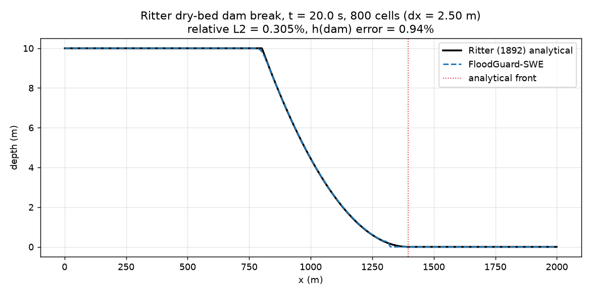
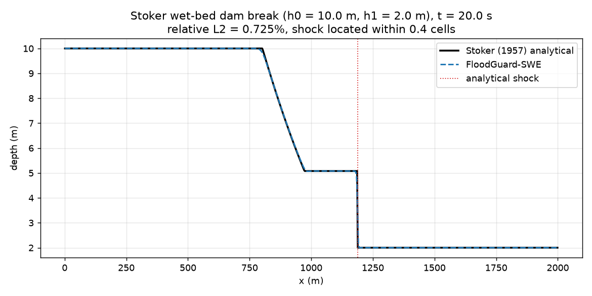
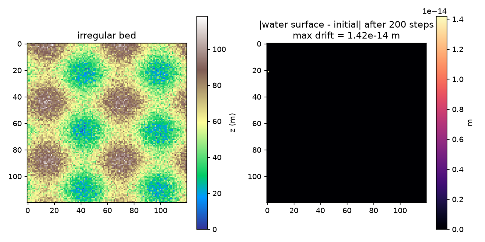
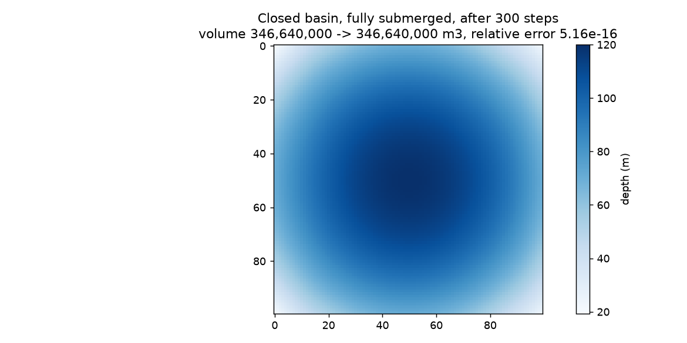
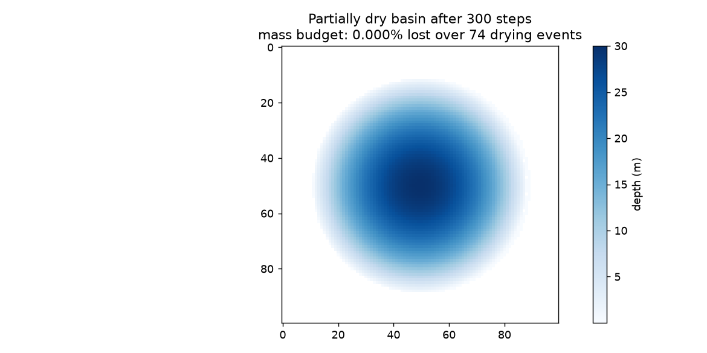
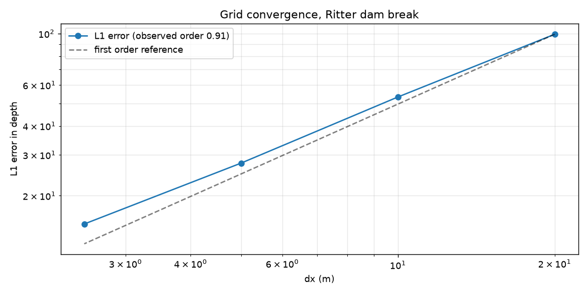
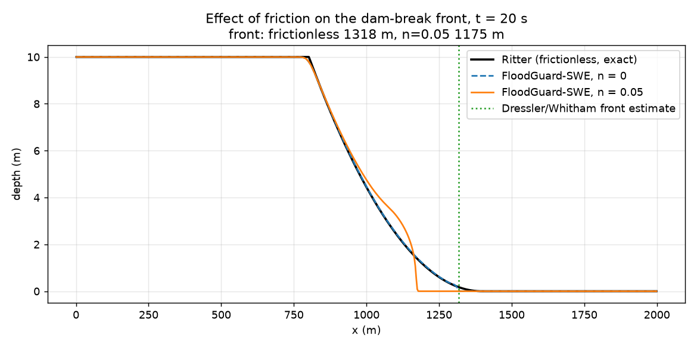

# Solver verification

Verification asks whether the code solves the equations it claims to solve.
These are analytical solutions and closed-form invariants, so the answers are
exact and the comparison is not a matter of opinion.

**7 of 7 checks passed** (5.4s).

| Check | Result | Criterion |
| --- | --- | --- |
| Ritter dry-bed dam break | PASS | relative L2 0.305% < 5%, h(dam) error 0.94% < 5%, front lag 18.3% in [0%, 25%) |
| Stoker wet-bed dam break | PASS | relative L2 0.725% < 5%, shock within 0.4 < 12 cells |
| Lake at rest over irregular bed (well-balancedness) | PASS | spurious discharge 3.92e-12 < 1e-10, surface drift 1.42e-14 m < 1e-10 |
| Mass conservation, no wet/dry front | PASS | relative volume error 5.16e-16 < 1e-9 |
| Wet/dry mass budget (measured cost of drying) | PASS | relative mass loss 0.000% < 1% |
| Grid convergence (Ritter) | PASS | observed order 0.91 > 0.8 and error decreases with dx |
| Frictional dam break (front retardation) | PASS | rough front 1175 m < frictionless 1318 m <= Ritter 1396 m |

## Detail

### Ritter dry-bed dam break

**PASS** — relative L2 0.305% < 5%, h(dam) error 0.94% < 5%, front lag 18.3% in [0%, 25%)

The front lag is expected and is documented, not a defect: a monotone second-order scheme cannot resolve the infinite-gradient tip where depth reaches zero. It must never LEAD the analytical front, which would mean the wave is arriving too early.



```json
{
  "L1": 15.109891703070657,
  "L2": 0.9255161886314835,
  "Linf": 0.17278879434349825,
  "RMSE": 0.020695171120565153,
  "relative_L2": 0.0030500718722684277,
  "n_cells": 800,
  "dam_depth_m": 4.486356806264114,
  "dam_depth_expected_m": 4.444444444444445,
  "dam_depth_error_pct": 0.9430281409425589,
  "front_numerical_m": 1323.75,
  "front_analytical_m": 1396.1817764612601,
  "front_lag_fraction": 0.18282460417091584,
  "front_threshold_m": 0.01,
  "t_s": 20.0,
  "dx_m": 2.5
}
```

### Stoker wet-bed dam break

**PASS** — relative L2 0.725% < 5%, shock within 0.4 < 12 cells

The wet-bed case is the one that matters for a real reach, where the flood runs onto an existing river rather than a dry bed. It produces a genuine shock, so it tests the HLLC solver rather than only the rarefaction.



```json
{
  "L1": 12.80354812864486,
  "L2": 2.277692556472453,
  "Linf": 1.1398026757823256,
  "RMSE": 0.05093075388117684,
  "relative_L2": 0.007250609421213781,
  "n_cells": 800,
  "shock_numerical_m": 1188.75,
  "shock_analytical_m": 1187.7969741217005,
  "shock_error_cells": 0.38121035131980535,
  "shock_speed_ms": 9.389848706085026,
  "t_s": 20.0
}
```

### Lake at rest over irregular bed (well-balancedness)

**PASS** — spurious discharge 3.92e-12 < 1e-10, surface drift 1.42e-14 m < 1e-10

Over a bed with 118 m of relief. A non-well-balanced scheme produces velocities of order sqrt(g*dz) here, i.e. several m/s of flow that does not exist.



```json
{
  "max_water_surface_drift_m": 1.4210854715202004e-14,
  "max_spurious_discharge_m2s": 3.922195901395755e-12,
  "max_depth_change_m": 1.4210854715202004e-14,
  "steps": 200,
  "bed_relief_m": 118.4089327422326
}
```

### Mass conservation, no wet/dry front

**PASS** — relative volume error 5.16e-16 < 1e-9

Water is given an initial momentum so it sloshes against the walls; a static test would pass trivially. Every cell stays wet throughout, so this measures the flux scheme alone.



```json
{
  "initial_volume_m3": 346639999.9999999,
  "final_volume_m3": 346639999.9999997,
  "relative_error": 5.158491066413914e-16,
  "steps": 300,
  "dried_cells": 0
}
```

### Wet/dry mass budget (measured cost of drying)

**PASS** — relative mass loss 0.000% < 1%

This is not a conservation failure to be fixed; it is the price of a wet/dry treatment, quantified. The number is reported alongside every simulation so a reviewer can see what it cost on their own case.



```json
{
  "initial_volume_m3": 28275583.999999996,
  "final_volume_m3": 28275484.9753146,
  "relative_loss": 3.5021269727884025e-06,
  "drying_events": 74,
  "theoretical_bound": 1.0468395630661422e-06,
  "dry_tolerance_m": 0.001,
  "shoreline_cells_initial": 140,
  "steps": 300
}
```

### Grid convergence (Ritter)

**PASS** — observed order 0.91 > 0.8 and error decreases with dx

Second order is not attainable on a discontinuous solution; roughly first order in L1 is the expected and correct result at a shock.



```json
{
  "resolutions": [
    100,
    200,
    400,
    800
  ],
  "dx_m": [
    20.0,
    10.0,
    5.0,
    2.5
  ],
  "L1_errors": [
    99.31056553054532,
    53.28398803888703,
    27.64760703751184,
    15.109891703070657
  ],
  "observed_order": 0.9095909124049657
}
```

### Frictional dam break (front retardation)

**PASS** — rough front 1175 m < frictionless 1318 m <= Ritter 1396 m

The Dressler/Whitham line is a first-order asymptotic estimate shown for orientation, not a precision benchmark. The assertion being tested is the ordering: friction must retard the front, and the frictionless front must never outrun Ritter.



```json
{
  "front_frictionless_m": 1318.3333333333335,
  "front_rough_m": 1175.0,
  "ritter_front_m": 1396.1817764612601,
  "dressler_estimate_m": 1317.2579330179249,
  "retardation_m": 143.33333333333348,
  "manning_n": 0.05
}
```

## What these do not establish

Verification is not validation. Passing every check above means the numerics
are right; it says nothing about whether the DEM, the breach parameters, the
roughness field or the reservoir bathymetry describe the real river. Those are
validation questions, and they are answered separately against observed events.